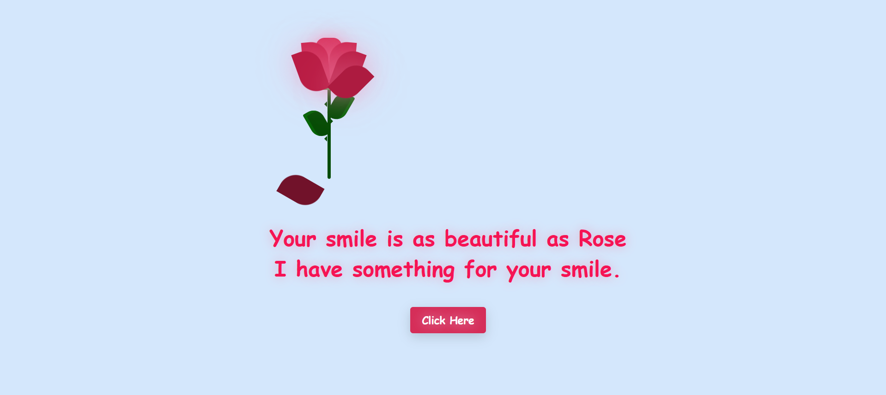

# Petal of Letters 🌹

Celebrate Rose Day with **Petal of Letters**—a heartfelt web project designed to share love and joy. It features an elegant, interactive greeting card and a stylish postcard with smooth animations and a pleasant user experience.

## Features

- **Personalized Rose Day Greeting**: The main page displays a poetic and romantic message, perfect for celebrating the occasion.
- **Interactive Postcard**: A rotating postcard with smooth hover effects that make the design feel lively and engaging.
- **Rose Element**: The design includes a beautiful rose graphic, symbolizing the essence of Rose Day. The rose is delicately woven into the message and styling to enhance the overall theme.
- **Eye-Catching Styling**: Beautiful color schemes, animations, and subtle shadows that enhance the aesthetics.
- **Mobile-Responsive Design**: Optimized for all screen sizes, ensuring a smooth experience on both desktop and mobile devices.
- **Smooth Animations**: Subtle hover effects and smooth transitions create a dynamic, interactive experience.
- **Customizable Messages**: Easily modify the message on the main page for different occasions or to personalize it further.
- **CSS Organization**: Two dedicated CSS files, keeping the structure clean and easy to maintain, with one for the main page and one for the postcard.

## Preview

Here’s a preview of the **Petal of Letters** project:

## How It Works

1. The **Main Page** (`index.html`) welcomes visitors with a beautifully written Rose Day message, setting a romantic tone, along with a beautifully designed rose graphic to complement the theme.
2. The **Postcard** is designed with hover effects and smooth animations that add a playful and engaging touch to the design.
3. **Hover Interaction**: As the user hovers over the postcard, it gently rotates, providing a dynamic and interactive feel.
4. **Responsive Design**: The layout and content automatically adjust to look great on any device, whether on a phone, tablet, or desktop.
5. **Color and Animation**: The project uses gentle, pleasant colors and smooth animations, making the experience immersive and visually appealing.

## Customizing Your Experience

- **Change the Message**: Head to the `index.html` file and modify the text inside the `
` to reflect your own personalized message or the occasion you're celebrating.
- **Adjust Animation Effects**: If you'd like to tweak the hover animations or other transitions, go to the `styles.css` or `postcard.css` files and adjust the keyframes or animation duration.
- **Modify Colors**: You can adjust the color scheme by changing the `background-color`, `color`, and `border` properties in the CSS files. Try out different palettes for a fresh look!

## Expanding the Project

- **Add More Postcards**: If you want to add more interactive postcards, you can duplicate the postcard section in the HTML and adjust its content. You can also create more animations and add new styles to each one.
- **Include Sound Effects**: Add some soft background music or sound effects for interaction. For example, a gentle chime when the user hovers over the postcard or an audio message when the page loads could make it more immersive.
- **Add Social Media Sharing**: Add buttons for sharing the greeting card or postcard on social media platforms. You can use platforms like Twitter, Facebook, or Instagram to spread the Rose Day message.

## Contributions

We welcome contributions to improve and expand the project! If you'd like to contribute, feel free to:

1. Open an issue to suggest new features or report bugs.
2. Fork the repository, make your changes, and submit a pull request.

We appreciate your help in making **Petal of Letters** even better!

---

**Happy Rose Day! 🌹**  
Thank you for exploring the "Petal of Letters" project. May it inspire you to share your love and appreciation with those who matter most!

---

**PS**: I don't need a special day to say this to you. ❤️
